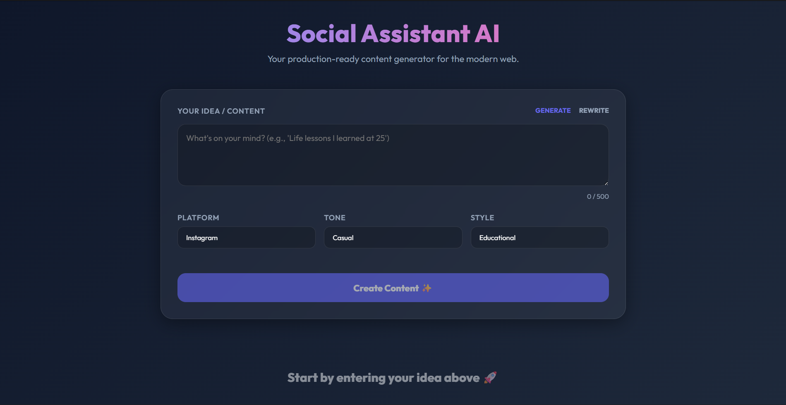

# AI Social Media Assistant  

Transform your ideas into high-engagement social media content for **Instagram, LinkedIn, and Twitter (X)** in seconds — powered by **Google Gemini AI**.




---

## Key Features  

- **Platform-Specific Intelligence**  
  Automatically adapts tone, hashtags, and formatting for each platform.  

- **Smart Mode Toggle**  
  Switch between:  
  - **Generate** → Create content from scratch  
  - **Rewrite** → Improve existing drafts  

- **Customizable Tone & Style**  
  Choose from Professional, Casual, Motivational, Funny, or Educational tones.  

- **Real-Time Preview**  
  Interactive UI with live previews for each platform.  

- **AI-Powered Generation**  
  Uses **Gemini 1.5 Flash** for fast and high-quality content generation.  

---

## Tech Stack  

| Layer      | Technology |
|------------|-----------|
| Frontend   | React.js, Vanilla CSS (Glassmorphism UI), Axios |
| Backend    | Node.js, Express.js |
| AI Engine  | Google Generative AI (Gemini 1.5 Flash) |
| Tooling    | Concurrently, Dotenv |

---

## Quick Start  

### 1. Prerequisites  

- Install **Node.js**  
- Get a **Google Gemini API Key**  
  https://aistudio.google.com/app/apikey  

---

### 2. Environment Setup  

Clone the repository and configure environment variables:

```bash
cd backend
cp .env.example .env
```

Edit `.env`:

```env
GEMINI_API_KEY=your_actual_key_here
PORT=5000
```

---

### 3. Install & Run  

From the root directory:

```bash
npm run install-all   # Install frontend + backend dependencies
npm start             # Run both servers concurrently
```

- Frontend → http://localhost:3000  
- Backend → http://localhost:5000  

---

## Project Structure  

```text
├── assets/
│   └── ui-screenshot.png      # Application UI screenshot
├── backend/
│   ├── services/
│   │   ├── geminiService.js   # Handles Gemini API calls
│   │   └── promptBuilder.js   # Platform-specific prompt logic
│   ├── routes/
│   │   └── contentRoute.js    # API endpoints & validation
│   └── server.js              # Backend entry point
│
├── frontend/src/
│   ├── components/            # UI components
│   ├── App.js                 # Main React logic
│   └── App.css                # Styling (Glassmorphism UI)
│
└── package.json               # Root config for concurrent scripts
```

---

## Security & Best Practices  

- `.env` is excluded via `.gitignore`  
- Use `.env.example` as a template  
- Never commit API keys  
- Use environment variables (e.g., GitHub Secrets) in production  

---

## Troubleshooting  

- **404 Not Found**  
  Ensure you're using a valid model name (e.g., `gemini-1.5-flash`)  

- **503 Service Unavailable**  
  Free-tier API may be under heavy load — retry after a few seconds  

- **429 Too Many Requests**  
  You’ve exceeded your API rate limit  

---

## License  

This project is licensed under the **MIT License**.  
See the [LICENSE](LICENSE) file for details.  
