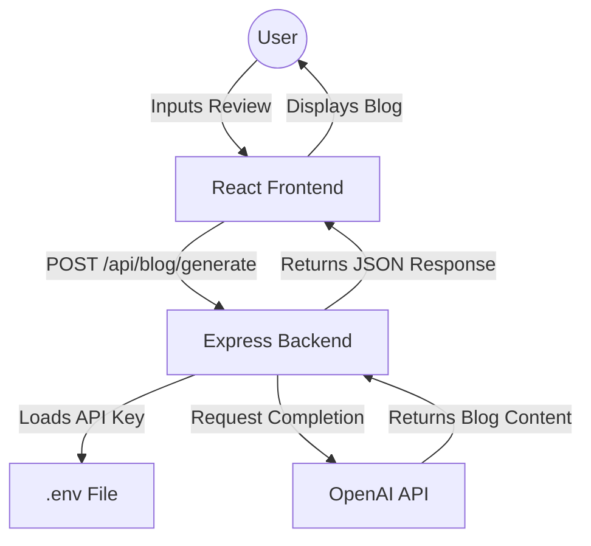

# 📘 Comprehensive Project Walkthrough: AI Blog Generator

This document provides a detailed, end-to-end explanation of the AI Blog Generator project. This application allows users to input short reviews and receive a full-length, AI-generated blog post in response.

---

## 🏗️ Project Architecture

The application follows a classic **Client-Server architecture**. The React frontend communicates with an Express backend, which in turn interacts with the OpenAI API.



---

## 📂 File Structure Overview

The project is organized into `frontend` and `backend` directories to separate concerns.

```text
d:\my-gpt-blog-app\
├── backend/
│   ├── routes/
│   │   └── blogRoute.js   # API Endpoint Logic
│   └── .env               # Private API Keys (Secured)
├── frontend/
│   └── src/
│       ├── App.js         # Main UI Shell
│       └── BlogGenerator.js # Core Generator Logic
├── .gitignore             # Version Control Exclusions
└── README.md              # Project Documentation
```

---

## 🔒 Security & Configuration

### Environment Variables
To protect sensitive credentials, the project uses a [.env](file:///d:/my-gpt-blog-app/backend/.env) file located in the `backend/` directory.

- **File**: [backend/.env](file:///d:/my-gpt-blog-app/backend/.env)
- **Key**: `OPENAI_API_KEY`
- **Protection**: The root [.gitignore](file:///d:/my-gpt-blog-app/.gitignore) ensures this file is never uploaded to public repositories like GitHub.

### Secure API Implementation
In [blogRoute.js](file:///d:/my-gpt-blog-app/backend/routes/blogRoute.js), the API key is no longer hardcoded. Instead, it is loaded dynamically:

```javascript
require('dotenv').config();
const configuration = new Configuration({
  apiKey: process.env.OPENAI_API_KEY,
});
```

---

## 🛠️ Component Breakdown

### 1. Frontend: The User Interface
- **App.js**: The entry point for the React UI. It provides the basic layout and global styles.
- **BlogGenerator.js**: 
    - **State**: Tracks `review` (input) and `blog` (output).
    - **Interaction**: Uses `axios` to send the review to the server.
    - **Display**: Conditionally renders the generated blog post only after it's received.

### 2. Backend: The Processing Hub
- **blogRoute.js**: Uses the `openai` library to connect to the `gpt-3.5-turbo` model.
- **Prompt Engineering**: The server wraps the user's input in a specific command: `"Write a blog from this user review: ${userReview}"`.

---

## 🔄 Data Flow: Step-by-Step

1.  **Input**: User enters a review like *"The food was great but the service was slow"* in the `<textarea>`.
2.  **Trigger**: User clicks **Generate Blog**, firing the [handleGenerate](file:///d:/my-gpt-blog-app/frontend/src/BlogGenerator.js#8-12) function.
3.  **Request**: An HTTP POST request is sent to `http://localhost:5000/api/blog/generate`.
4.  **Processing**: The Express route extracts the review, loads the OpenAI key, and calls GPT-3.5.
5.  **Response**: The server sends back a JSON object: `{ "blog": "...content..." }`.
6.  **Update**: React updates its state, and the new blog post appears instantly on the screen.

---

## 🚀 Next Steps for Development

> [!TIP]
> To turn this into a production-ready app, consider adding:
> 1. **Loading Spinners**: Show a progress indicator while waiting for the AI.
> 2. **Error Handling**: Gracefully handle API timeout or invalid key errors.
> 3. **Rich Text Formatting**: Use a library like `react-markdown` to render the generated blog with proper headings and styles.
